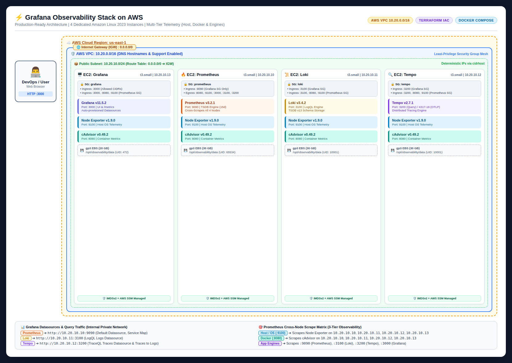

# Grafana Observability Stack on AWS (IaC)

A modular, automated, production-ready Infrastructure as Code (IaC) solution using **Terraform** to provision a complete 4-pillar observability platform (**Metrics, Logs, Traces, and Dashboards**) on **Amazon Web Services (AWS)** using **Docker Compose** on dedicated Amazon Linux 2023 EC2 instances.

> 📚 **Live Documentation Site**: [https://prappalini.github.io/OBSERVABILITY-IAC-GRAFANA_STACK-AWS/](https://prappalini.github.io/OBSERVABILITY-IAC-GRAFANA_STACK-AWS/)

---

## Architecture Overview



> **Architecture Diagram Formats**:
> - 🌐 **Interactive HTML Render**: [`docs/architecture.html`](docs/architecture.html)
> - 🖼️ **High-Resolution PNG**: [`docs/architecture.png`](docs/architecture.png)
> - 📐 **Draw.io Editable Diagram**: [`docs/architecture.drawio`](docs/architecture.drawio)

Each core observability component runs isolated on its own EC2 instance within a dedicated AWS VPC. Every node runs **Node Exporter** and **cAdvisor** alongside the core service, providing 360-degree observability across host OS, container runtime, and application engine layers.

```mermaid
flowchart TD
    subgraph Internet ["🌐 Internet"]
        User["👨‍💻 DevOps / Engineer"]
    end

    subgraph AWS_VPC ["AWS VPC: 10.20.0.0/16"]
        IGW["Internet Gateway"]

        subgraph Public_Subnet ["Public Subnet: 10.20.10.0/24"]
            
            subgraph Node_Grafana ["EC2: Grafana (t3.small)"]
                Grafana["Grafana v11.5.2 (:3000)"]
                NodeExp_Grafana["Node Exporter (:9100)"]
                cAdvisor_Grafana["cAdvisor (:8080)"]
                SG_Grafana["SG: Ingress :3000 (User CIDRs)<br/>:3000, :8080, :9100 (Prometheus SG)"]
            end

            subgraph Node_Prometheus ["EC2: Prometheus (t3.small)"]
                Prometheus["Prometheus v3.2.1 (:9090)"]
                NodeExp_Prom["Node Exporter (:9100)"]
                cAdvisor_Prom["cAdvisor (:8080)"]
                SG_Prometheus["SG: Ingress :9090 (Grafana SG Only)"]
            end

            subgraph Node_Loki ["EC2: Loki (t3.small)"]
                Loki["Loki v3.4.2 (:3100)"]
                NodeExp_Loki["Node Exporter (:9100)"]
                cAdvisor_Loki["cAdvisor (:8080)"]
                SG_Loki["SG: Ingress :3100 (Grafana SG)<br/>:3100, :8080, :9100 (Prometheus SG)"]
            end

            subgraph Node_Tempo ["EC2: Tempo (t3.small)"]
                Tempo["Tempo v2.7.1 (:3200 / :4317 / :4318)"]
                NodeExp_Tempo["Node Exporter (:9100)"]
                cAdvisor_Tempo["cAdvisor (:8080)"]
                SG_Tempo["SG: Ingress :3200 (Grafana SG)<br/>:3200, :8080, :9100 (Prometheus SG)"]
            end
        end
    end

    User -->|HTTP :3000 (UI)| SG_Grafana --> Grafana
    Grafana -->|Query :9090| SG_Prometheus --> Prometheus
    Grafana -->|Query :3100| SG_Loki --> Loki
    Grafana -->|Query :3200| SG_Tempo --> Tempo

    Prometheus -.->|Scrape :9100, :8080, :3000| SG_Grafana
    Prometheus -.->|Scrape :9100, :8080, :3100| SG_Loki
    Prometheus -.->|Scrape :9100, :8080, :3200| SG_Tempo
    Prometheus -.->|Local Scrape :9100, :8080, :9090| NodeExp_Prom

    IGW --- Public_Subnet
```

---

## Stack Components & Specifications

| Component | Docker Image | Listening Port(s) | Storage / Retention | Deployment Scope | Description |
| :--- | :--- | :--- | :--- | :--- | :--- |
| **Grafana** | `grafana/grafana:11.5.2` | `3000` | 20 GB gp3 EBS | Dedicated Node | Visualization platform with auto-provisioned, linked datasources. |
| **Prometheus** | `prom/prometheus:v3.2.1` | `9090` | 30 GB gp3 EBS (15d retention) | Dedicated Node | Time-series metrics engine and TSDB storage. |
| **Loki** | `grafana/loki:3.4.2` | `3100` | 30 GB gp3 EBS (TSDB v13) | Dedicated Node | Log aggregation and query engine (LogQL). |
| **Tempo** | `grafana/tempo:2.7.1` | `3200`, `4317`, `4318` | 30 GB gp3 EBS (48h retention) | Dedicated Node | Distributed tracing backend supporting OTLP gRPC/HTTP. |
| **Node Exporter** | `prom/node-exporter:v1.9.0` | `9100` | N/A (Host metrics) | **All 4 Nodes** | Host CPU, memory, disk I/O, filesystem, and network collector. |
| **cAdvisor** | `gcr.io/cadvisor/cadvisor:v0.49.2` | `8080` | N/A (Container metrics) | **All 4 Nodes** | Container resource usage, memory limits, and CPU throttling. |

---

## Multi-Layer Observability & Monitoring Strategy

To ensure high availability and prevent silent failures in production, the stack implements a **3-tier observability model**:

```text
┌──────────────────────────────────────────────────────────────────┐
│  Tier 3: Application Engine Metrics (/metrics: 9090, 3100, 3200, 3000) │
│  - Ingestion rates, compaction status, query latency, span stats │
├──────────────────────────────────────────────────────────────────┤
│  Tier 2: Container Runtime Metrics (cAdvisor: 8080)              │
│  - Per-container CPU throttling, memory limits, OOM kills        │
├──────────────────────────────────────────────────────────────────┤
│  Tier 1: Host / OS Metrics (Node Exporter: 9100)                 │
│  - EBS disk capacity exhaustion, kernel memory, CPU load, I/O    │
└──────────────────────────────────────────────────────────────────┘
```

### 1. Host / OS Telemetry (`node_exporter` - Port `9100`)
- **EBS Disk Capacity Alerts**: Logs (Loki) and traces (Tempo) generate continuous disk writes. Monitoring disk usage prevents silent disk exhaustion crashes.
- **System Memory & Swap**: Identifies memory pressure before the Linux kernel OOM killer terminates core services.
- **CPU & Load Average**: Detects CPU saturation caused by heavy LogQL/PromQL queries or high ingestion bursts.
- **Network I/O**: Tracks network bandwidth consumption between workload collectors and the observability nodes.

### 2. Container Telemetry (`cadvisor` - Port `8080`)
- **Per-Container Memory Allocation**: Pinpoints exact memory consumption inside each Docker container, isolating memory leaks.
- **cgroup CPU Throttling**: Detects if container CPU limits are restricting ingestion or query execution speeds.
- **Container Health & Restarts**: Real-time visibility into container crash loops and exit codes.

### 3. Application Engine Telemetry (Native `/metrics` Endpoints)
- **Loki Engine (`:3100/metrics`)**: Monitored by Prometheus for chunk memtable sizes, log ingestion rate (bytes/sec), compaction cycle durations, and query error rates.
- **Tempo Engine (`:3200/metrics`)**: Tracks span ingestion throughput, live trace buffer status, block flushes, and search query latencies.
- **Grafana Engine (`:3000/metrics`)**: Monitors active dashboard sessions, datasource query performance, alert evaluation timings, and API latency.
- **Prometheus Engine (`:9090/metrics`)**: Observes TSDB head series cardinality, chunk compaction, scrape interval delays, and WAL write latency.

---

## Key Security Features

- **Least-Privilege Network Ingress**:
  - **Grafana UI**: Port `3000` is open only to authorized CIDR ranges (`var.grafana_allowed_cidrs`).
  - **Datasource Queries**: Backend services (`9090`, `3100`, `3200`) accept query traffic **strictly** from the `grafana` Security Group.
  - **Metric Scraping**: Ports `9100` (Node Exporter), `8080` (cAdvisor), `3000` (Grafana), `3100` (Loki), and `3200` (Tempo) accept scrape traffic **strictly** from the `prometheus` Security Group.
- **Zero-Key SSH Administration (AWS Systems Manager)**: All instances are attached to an IAM Instance Profile with `AmazonSSMManagedInstanceCore`. You can connect securely via **AWS SSM Session Manager** without opening port 22 or managing SSH key pairs.
- **Deterministic Private IP Architecture**: Instances are provisioned with predictable, deterministic private IPs within the VPC (`cidrhost`), preventing Terraform cyclic dependencies during multi-directional bootstrap configuration.
- **IMDSv2 Enforced**: EC2 Instance Metadata Service v2 (`http_tokens = "required"`) is mandated on all nodes to prevent SSRF vulnerabilities.
- **Encrypted Storage**: All root EBS volumes use `gp3` with encryption at rest (`encrypted = true`).
- **Host Bind-Mount Storage (`/opt/observability/data`)**: Container data is stored directly on the host in `/opt/observability/data` with proper Linux UID permissions (`472` for Grafana, `65534` for Prometheus, `10001` for Loki/Tempo), simplifying direct backups, EBS snapshots, and secondary volume expansion.
- **Pre-linked Telemetry Correlation**: Grafana automatically correlates telemetry data:
  - **Traces to Logs**: Direct transition from Tempo trace spans to corresponding Loki logs (`jsonData.tracesToLogsV2`).
  - **Service Map**: Auto-generated architecture dependency map powered by Prometheus metrics (`jsonData.serviceMap`).

---

## Repository Structure

```text
.
├── .github/
│   └── workflows/
│       └── deploy-docs.yml                        # GitHub Actions workflow for MkDocs GitHub Pages
├── docker/
│   ├── grafana/
│   │   ├── docker-compose.yml                     # Grafana + Node Exporter + cAdvisor
│   │   └── provisioning/datasources/datasources.yml
│   ├── loki/
│   │   ├── docker-compose.yml                     # Loki + Node Exporter + cAdvisor
│   │   └── loki-config.yml
│   ├── prometheus/
│   │   ├── docker-compose.yml                     # Prometheus + Node Exporter + cAdvisor
│   │   └── prometheus.yml                         # Cross-scraping jobs (all nodes & engines)
│   └── tempo/
│       ├── docker-compose.yml                     # Tempo + Node Exporter + cAdvisor
│       └── tempo.yml
├── docs/
│   ├── Internal-Documentation.md                  # Comprehensive architectural reference
│   ├── architecture.drawio                        # Native Draw.io editable architecture diagram
│   ├── architecture.html                          # Standalone HTML render of the architecture diagram
│   ├── architecture.md                            # Architecture & topology deep-dive
│   ├── architecture.png                           # High-resolution visual architecture diagram
│   ├── deployment.md                              # Detailed step-by-step deployment guide
│   ├── index.md                                   # Documentation home page
│   ├── security.md                                # Security, IAM & hardening specifications
│   ├── stylesheets/
│   │   └── extra.css                              # Custom CSS for MkDocs Material theme
│   └── telemetry.md                               # Multi-tier telemetry & scrape matrix
├── terraform/
│   ├── ec2.tf                                     # EC2 instances, EBS storage & bootstrap
│   ├── iam.tf                                     # IAM Roles, SSM policy & Instance Profile
│   ├── network.tf                                 # VPC, Subnet, IGW & Routing
│   ├── outputs.tf                                 # Public URLs and internal IPs
│   ├── security.tf                                # Security Groups (least-privilege matrix)
│   ├── templates/                                 # Cloud-init bootstrap templates
│   │   ├── bootstrap-grafana.sh.tftpl
│   │   ├── bootstrap-loki.sh.tftpl
│   │   ├── bootstrap-prometheus.sh.tftpl
│   │   └── bootstrap-tempo.sh.tftpl
│   ├── terraform.tfvars.example                   # Variable values template
│   ├── variables.tf                               # Input variable declarations
│   └── versions.tf                                # Terraform & AWS Provider versions
├── mkdocs.yml                                     # Material for MkDocs configuration
├── requirements-docs.txt                          # Python dependencies for documentation build
└── README.md
```

---

## 📚 Documentation Site (MkDocs)

The project includes an interactive documentation website built with **Material for MkDocs**, automatically deployed to **GitHub Pages** on every push to `master`.

### Local Documentation Server

To preview the documentation locally with hot reloading:

```bash
# Install dependencies
pip install -r requirements-docs.txt

# Start live preview server
mkdocs serve
```

Access the documentation at `http://127.0.0.1:8000`.

### Build Static Site

```bash
mkdocs build
```

---

## Deployment Guide

### 1. Prerequisites
- **Terraform** >= 1.5.0 installed (`terraform --version`) or **OpenTofu**.
- **AWS CLI** configured with administrative credentials (`aws sts get-caller-identity`).
- Your public IP address to restrict access to Grafana (run `curl -s https://checkip.amazonaws.com`).

### 2. Configure Variables
Navigate into the `terraform/` directory and create your custom `terraform.tfvars`:

```bash
cd terraform
cp terraform.tfvars.example terraform.tfvars
```

Edit `terraform.tfvars` with your settings:

```hcl
aws_region        = "us-east-1"
availability_zone = "us-east-1a"

# Restrict Grafana access to your IP address (CIDR /32)
grafana_allowed_cidrs = ["203.0.113.10/32"]

# (Optional) Allow SSH if key_name is provided (recommended: leave empty and use AWS SSM)
ssh_allowed_cidrs     = []
# key_name            = "my-ec2-key"

# Instance sizing (default: t3.small)
prometheus_instance_type = "t3.small"
grafana_instance_type    = "t3.small"
loki_instance_type       = "t3.small"
tempo_instance_type      = "t3.small"

# Storage size in GB
prometheus_volume_size_gb = 30
grafana_volume_size_gb    = 20
loki_volume_size_gb       = 30
tempo_volume_size_gb      = 30

# Grafana Admin Credentials
grafana_admin_user     = "admin"
grafana_admin_password = "YourStrongSecurePasswordHere!"
```

### 3. Initialize & Deploy

```bash
# Initialize Terraform and download AWS provider
terraform init

# Review execution plan
terraform plan

# Apply infrastructure deployment
terraform apply
```

Upon successful completion, Terraform will output the public URL of Grafana:

```text
Outputs:

grafana_url = "http://ec2-xx-xx-xx-xx.compute-1.amazonaws.com:3000"
grafana_instance_id = "i-0123456789abcdef0"
prometheus_private_ip = "10.20.10.10"
loki_private_ip = "10.20.10.11"
tempo_private_ip = "10.20.10.12"
```

> **Note**: Allow **2 to 3 minutes** after EC2 creation for cloud-init to install Docker, pull the container images, and start all services.

---

## Verification & Post-Deployment

1. Open the URL provided by `grafana_url` in your browser.
2. Sign in with `grafana_admin_user` and `grafana_admin_password`.
3. Navigate to **Connections -> Data sources**:
   - **Prometheus** (Default)
   - **Loki**
   - **Tempo**
4. Click **Save & Test** on each data source to verify private network connectivity.
5. In **Explore**, query Prometheus metrics from:
   - `node_cpu_seconds_total` / `node_filesystem_avail_bytes` (Node Exporter across all 4 nodes)
   - `container_memory_usage_bytes` / `container_cpu_usage_seconds_total` (cAdvisor across all 4 nodes)
   - `loki_ingester_chunks_created_total` / `tempo_distributor_spans_received_total` / `grafana_http_request_duration_seconds_bucket` (App engines)

---

## Operations & Troubleshooting

### Connecting to Instances via AWS SSM (No SSH required)
You can open an interactive shell on any instance without opening port 22:

```bash
# Connect to Grafana
aws ssm start-session --target $(terraform output -raw grafana_instance_id)

# Connect to Prometheus
aws ssm start-session --target $(terraform output -raw prometheus_instance_id)

# Connect to Loki
aws ssm start-session --target $(terraform output -raw loki_instance_id)

# Connect to Tempo
aws ssm start-session --target $(terraform output -raw tempo_instance_id)
```

### Checking Container Status & Logs
Once inside any EC2 instance:

```bash
# Check Docker service status
sudo systemctl status docker

# View running containers (Core Service + Node Exporter + cAdvisor)
cd /opt/observability
sudo docker compose ps

# View real-time container logs
sudo docker compose logs -f
```

### Cloud-Init Bootstrap Logs
If a container fails to start during initial provisioning, inspect the boot logs:

```bash
sudo cat /var/log/cloud-init-output.log
```

---

## Integrating Workloads

- **Shipping Logs to Loki**: Point Promtail, Fluent Bit, or OpenTelemetry Collector to `http://<LOKI_PRIVATE_IP>:3100/loki/api/v1/push`.
- **Sending Traces to Tempo**: Export OTLP traces from your applications to `http://<TEMPO_PRIVATE_IP>:4317` (gRPC) or `http://<TEMPO_PRIVATE_IP>:4318` (HTTP). *(Ensure appropriate SG ingress rules from your workload subnets).*
- **Scraping Custom Metrics in Prometheus**: Add scrape target endpoints to `/opt/observability/prometheus/prometheus.yml` or configure service discovery.

---

## Clean Up / Destroy

To tear down all AWS resources and prevent ongoing costs:

```bash
cd terraform
terraform destroy
```

---

## Production Readiness Recommendations

For enterprise production environments, consider the following enhancements:
1. **TLS / HTTPS**: Place an AWS Application Load Balancer (ALB) with an AWS ACM SSL/TLS certificate in front of Grafana and place the EC2 instances inside private subnets.
2. **Object Storage Backends**: Configure Loki and Tempo to use **Amazon S3** for chunk/block storage with lifecycle rules.
3. **Secret Management**: Inject credentials via **AWS Secrets Manager** or AWS Systems Manager Parameter Store.
4. **Backup Strategy**: Configure AWS Backup or automated EBS snapshot policies for the Prometheus TSDB volume.
