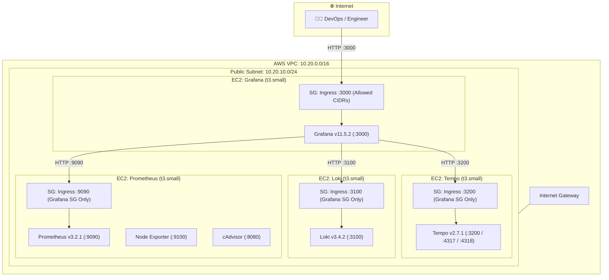

# Grafana Observability Stack on AWS (IaC)

A modular, automated, production-ready Infrastructure as Code (IaC) solution using **Terraform** to provision a complete 4-pillar observability platform (**Metrics, Logs, Traces, and Dashboards**) on **Amazon Web Services (AWS)** using **Docker Compose** on dedicated Amazon Linux 2023 EC2 instances.

---

## Architecture Overview

Each core observability component runs isolated on its own EC2 instance within a dedicated AWS VPC:



---

## Stack Components & Specifications

| Component | Docker Image | Listening Port | Storage / Retention | Description |
| :--- | :--- | :--- | :--- | :--- |
| **Grafana** | `grafana/grafana:11.5.2` | `3000` | 20 GB gp3 EBS | Visualization platform with auto-provisioned, linked datasources. |
| **Prometheus** | `prom/prometheus:v3.2.1` | `9090` | 30 GB gp3 EBS (15d retention) | Time-series metrics engine and TSDB storage. |
| **Node Exporter** | `prom/node-exporter:v1.9.0` | `9100` (Docker net) | N/A (Host metrics) | Host CPU, memory, disk, and network metrics collector. |
| **cAdvisor** | `gcr.io/cadvisor/cadvisor:v0.49.2` | `8080` (Docker net) | N/A (Container metrics) | Container resource usage and performance metrics. |
| **Loki** | `grafana/loki:3.4.2` | `3100` | 30 GB gp3 EBS (TSDB v13) | Log aggregation and query engine (LogQL). |
| **Tempo** | `grafana/tempo:2.7.1` | `3200`, `4317`, `4318` | 30 GB gp3 EBS (48h retention) | Distributed tracing backend supporting OTLP gRPC/HTTP. |

---

## Key Security Features

- **Least-Privilege Network Ingress**: Backend services (Prometheus, Loki, Tempo) are **not exposed** to the internet. AWS Security Groups restrict ingress ports (`9090`, `3100`, `3200`) strictly to the private IP traffic originating from the `grafana` Security Group.
- **Zero-Key SSH Administration (AWS Systems Manager)**: All instances are attached to an IAM Instance Profile with `AmazonSSMManagedInstanceCore`. You can connect securely via **AWS SSM Session Manager** without opening port 22 or managing SSH key pairs.
- **IMDSv2 Enforced**: EC2 Instance Metadata Service v2 (`http_tokens = "required"`) is mandated on all nodes to prevent SSRF vulnerabilities.
- **Encrypted Storage**: All root EBS volumes use `gp3` with encryption at rest (`encrypted = true`).
- **Host Bind-Mount Storage (`/opt/observability/data`)**: Container data is stored directly on the host in `/opt/observability/data` with proper Linux UID permissions (`472` for Grafana, `65534` for Prometheus, `10001` for Loki/Tempo), simplifying direct backups, EBS snapshots, and secondary volume expansion.
- **Pre-linked Telemetry Correlation**: Grafana automatically correlates telemetry data:
  - **Traces to Logs**: Direct transition from Tempo trace spans to corresponding Loki logs.
  - **Service Map**: Auto-generated architecture dependency map powered by Prometheus metrics.

---

## Repository Structure

```text
.
├── docker/
│   ├── grafana/
│   │   ├── docker-compose.yml
│   │   └── provisioning/datasources/datasources.yml
│   ├── loki/
│   │   ├── docker-compose.yml
│   │   └── loki-config.yml
│   ├── prometheus/
│   │   ├── docker-compose.yml
│   │   └── prometheus.yml
│   └── tempo/
│       ├── docker-compose.yml
│       └── tempo.yml
├── docs/
├── terraform/
│   ├── compute.tf                 # EC2 instances, EBS volumes & bootstrap logic
│   ├── iam.tf                     # IAM Roles, SSM policy & Instance Profile
│   ├── network.tf                 # VPC, Subnet, IGW & Routing
│   ├── outputs.tf                 # Public URLs and internal IPs
│   ├── security.tf                # Security Groups & ingress/egress rules
│   ├── templates/                 # Cloud-init / user_data scripts
│   │   ├── bootstrap-grafana.sh.tftpl
│   │   ├── bootstrap-loki.sh.tftpl
│   │   ├── bootstrap-prometheus.sh.tftpl
│   │   └── bootstrap-tempo.sh.tftpl
│   ├── terraform.tfvars.example   # Variable values template
│   ├── variables.tf               # Input variable declarations
│   └── versions.tf                # Terraform & AWS Provider versions
└── README.md
```

---

## Deployment Guide

### 1. Prerequisites
- **Terraform** >= 1.5.0 installed (`terraform --version`) or **OpenTofu**.
- **AWS CLI** configured with administrative credentials (`aws sts get-caller-identity`).
- Your public IP address to restrict access to Grafana (run `curl -s https://checkip.amazonaws.com`).

### 2. Configure Variables
Navigate into the `terraform/` directory and create your custom `terraform.tfvars`:

```bash
cd terraform
cp terraform.tfvars.example terraform.tfvars
```

Edit `terraform.tfvars` with your settings:

```hcl
aws_region        = "us-east-1"
availability_zone = "us-east-1a"

# Restrict Grafana access to your IP address (CIDR /32)
grafana_allowed_cidrs = ["203.0.113.10/32"]

# (Optional) Allow SSH if key_name is provided (recommended: leave empty and use AWS SSM)
ssh_allowed_cidrs     = []
# key_name            = "my-ec2-key"

# Instance sizing (default: t3.small)
prometheus_instance_type = "t3.small"
grafana_instance_type    = "t3.small"
loki_instance_type       = "t3.small"
tempo_instance_type      = "t3.small"

# Storage size in GB
prometheus_volume_size_gb = 30
grafana_volume_size_gb    = 20
loki_volume_size_gb       = 30
tempo_volume_size_gb      = 30

# Grafana Admin Credentials
grafana_admin_user     = "admin"
grafana_admin_password = "YourStrongSecurePasswordHere!"
```

### 3. Initialize & Deploy

```bash
# Initialize Terraform and download AWS provider
terraform init

# Review execution plan
terraform plan

# Apply infrastructure deployment
terraform apply
```

Upon successful completion, Terraform will output the public URL of Grafana:

```text
Outputs:

grafana_url = "http://ec2-xx-xx-xx-xx.compute-1.amazonaws.com:3000"
grafana_instance_id = "i-0123456789abcdef0"
prometheus_private_ip = "10.20.10.x"
loki_private_ip = "10.20.10.y"
tempo_private_ip = "10.20.10.z"
```

> **Note**: Allow **2 to 3 minutes** after EC2 creation for cloud-init to install Docker, pull the container images, and start the services.

---

## Verification & Post-Deployment

1. Open the URL provided by `grafana_url` in your browser.
2. Sign in with `grafana_admin_user` and `grafana_admin_password`.
3. Navigate to **Connections -> Data sources**:
   - **Prometheus** (Default)
   - **Loki**
   - **Tempo**
4. Click **Save & Test** on each data source to verify private network connectivity.

---

## Operations & Troubleshooting

### Connecting to Instances via AWS SSM (No SSH required)
You can open an interactive shell on any instance without opening port 22:

```bash
# Connect to Grafana
aws ssm start-session --target $(terraform output -raw grafana_instance_id)

# Connect to Prometheus
aws ssm start-session --target $(terraform output -raw prometheus_instance_id)

# Connect to Loki
aws ssm start-session --target $(terraform output -raw loki_instance_id)

# Connect to Tempo
aws ssm start-session --target $(terraform output -raw tempo_instance_id)
```

### Checking Container Status & Logs
Once inside any EC2 instance:

```bash
# Check Docker service status
sudo systemctl status docker

# View running containers
cd /opt/observability
sudo docker compose ps

# View real-time container logs
sudo docker compose logs -f
```

### Cloud-Init Bootstrap Logs
If a container fails to start during initial provisioning, inspect the boot logs:

```bash
sudo cat /var/log/cloud-init-output.log
```

---

## Integrating Workloads

- **Shipping Logs to Loki**: Point Promtail, Fluent Bit, or OpenTelemetry Collector to `http://<LOKI_PRIVATE_IP>:3100/loki/api/v1/push`.
- **Sending Traces to Tempo**: Export OTLP traces from your applications to `http://<TEMPO_PRIVATE_IP>:4317` (gRPC) or `http://<TEMPO_PRIVATE_IP>:4318` (HTTP). *(Ensure appropriate SG ingress rules from your workload subnets).*
- **Scraping Custom Metrics in Prometheus**: Add scrape target endpoints to `/opt/observability/prometheus/prometheus.yml` or configure service discovery.

---

## Clean Up / Destroy

To tear down all AWS resources and prevent ongoing costs:

```bash
cd terraform
terraform destroy
```

---

## Production Readiness Recommendations

For enterprise production environments, consider the following enhancements:
1. **TLS / HTTPS**: Place an AWS Application Load Balancer (ALB) with an AWS ACM SSL/TLS certificate in front of Grafana and place the EC2 instances inside private subnets.
2. **Object Storage Backends**: Configure Loki and Tempo to use **Amazon S3** for chunk/block storage with lifecycle rules.
3. **Secret Management**: Inject credentials via **AWS Secrets Manager** or AWS Systems Manager Parameter Store.
4. **Backup Strategy**: Configure AWS Backup or automated EBS snapshot policies for the Prometheus TSDB volume.
