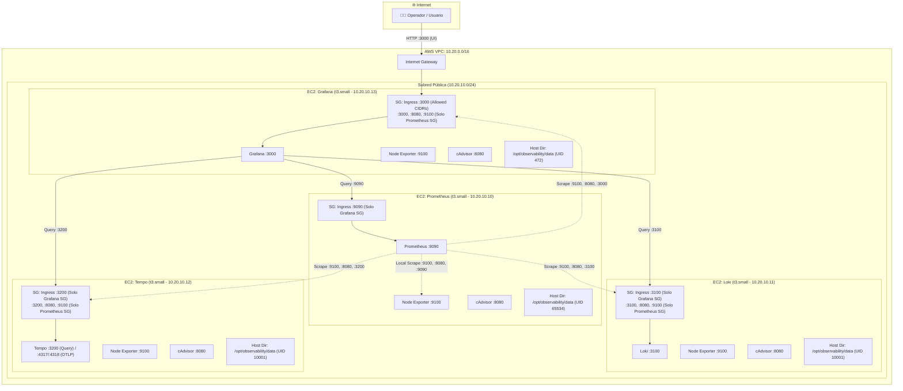

# Internal Documentation — Grafana Observability Stack on AWS

Este documento contiene el análisis arquitectónico, los hallazgos técnicos, el registro de correcciones, la estructura del código y las especificaciones operativas del stack de observabilidad desplegado mediante Terraform y Docker Compose sobre AWS.

---

## 1. Resumen Ejecutivo y Propósito

El objetivo de este repositorio es aprovisionar un stack completo de observabilidad de cuatro pilares (**Visualización, Métricas, Logs y Trazas**) en AWS mediante Infraestructura como Código (Terraform). 

Cada componente se ejecuta en una instancia EC2 dedicada con Docker Compose, utilizando almacenamiento montado directamente en el sistema de archivos del host (`/opt/observability/data`), garantizando aislamiento de procesos, facilidad de respaldo y compatibilidad con volúmenes EBS dedicados.

Para garantizar la alta disponibilidad y evitar fallos silenciosos, cada nodo ejecuta **Node Exporter** y **cAdvisor** junto con su servicio principal, permitiendo a Prometheus realizar scraping cruzado de telemetría a nivel de **Host/SO**, **Contenedores Docker** y **Métricas internas de motor de aplicación**.

### Componentes Principales

| Componente | Servicio / Imagen | Puerto(s) | Ámbito de Despliegue | Función Principal |
| :--- | :--- | :--- | :--- | :--- |
| **Grafana** | `grafana/grafana:11.5.2` | `3000` | Instancia Dedicada | Consola visual, paneles y exploración unificada. |
| **Prometheus** | `prom/prometheus:v3.2.1` | `9090` | Instancia Dedicada | Recolección y consulta de métricas (TSDB, retención de 15d). |
| **Loki** | `grafana/loki:3.4.2` | `3100` | Instancia Dedicada | Almacenamiento e indexación de logs con schema TSDB v13. |
| **Tempo** | `grafana/tempo:2.7.1` | `3200`, `4317/4318` | Instancia Dedicada | Trazabilidad distribuida y correlación de trazas con logs y métricas. |
| **Node Exporter** | `prom/node-exporter:v1.9.0` | `9100` | **Los 4 Nodos EC2** | Métricas del sistema operativo y host (CPU, Memoria, Disco EBS, Red). |
| **cAdvisor** | `gcr.io/cadvisor/cadvisor:v0.49.2` | `8080` | **Los 4 Nodos EC2** | Métricas de rendimiento, cgroups, límites y consumo de contenedores. |

---

## 2. Arquitectura del Sistema y Red


> **Formatos del Diagrama de Arquitectura**:
> - 🌐 **Render HTML**: [`docs/architecture.html`](architecture.html)
> - 🖼️ **Imagen PNG de Alta Resolución**: [`docs/architecture.png`](architecture.png)
> - 📐 **Diagrama Editable Draw.io**: [`docs/architecture.drawio`](architecture.drawio)

### Diagrama de Topología



### Seguridad y Aislamiento de Red (Matriz Least-Privilege)

1. **Grafana SG (`aws_security_group.grafana`)**:
   - Ingress `3000` desde `var.grafana_allowed_cidrs` (Acceso web a la UI).
   - Ingress `3000` (métricas de Grafana), `8080` (cAdvisor) y `9100` (Node Exporter) **exclusivamente** desde el Security Group de Prometheus.
   - Ingress opcional `22` (SSH) desde `var.ssh_allowed_cidrs`.
2. **Prometheus SG (`aws_security_group.prometheus`)**:
   - Ingress `9090` **exclusivamente** desde el Security Group de Grafana (consultas PromQL).
   - Ingress opcional `22` (SSH) desde `var.ssh_allowed_cidrs`.
3. **Loki SG (`aws_security_group.loki`)**:
   - Ingress `3100` desde el Security Group de Grafana (consultas LogQL).
   - Ingress `3100` (métricas de Loki), `8080` (cAdvisor) y `9100` (Node Exporter) **exclusivamente** desde el Security Group de Prometheus.
   - Ingress opcional `22` (SSH) desde `var.ssh_allowed_cidrs`.
4. **Tempo SG (`aws_security_group.tempo`)**:
   - Ingress `3200` desde el Security Group de Grafana (consultas TraceQL).
   - Ingress `3200` (métricas de Tempo), `8080` (cAdvisor) y `9100` (Node Exporter) **exclusivamente** desde el Security Group de Prometheus.
   - Ingress opcional `22` (SSH) desde `var.ssh_allowed_cidrs`.
5. **Administración sin llaves SSH (AWS SSM)**:
   - Todas las instancias utilizan `AmazonSSMManagedInstanceCore` para acceso seguro via **AWS Systems Manager Session Manager**.
6. **Hardening de Instancias**:
   - **IMDSv2**: Requerido en todas las VMs (`http_tokens = "required"`).
   - **EBS gp3**: Volúmenes cifrados en reposo (`encrypted = true`).

---

## 3. Estrategia de Observabilidad Multi-Capa y su Importancia Técnica

Para evitar puntos ciegos en producción, el stack monitorea tres capas diferenciadas:

```text
┌─────────────────────────────────────────────────────────────────────────────┐
│  CAPA 3: Telemetría de Motor / Aplicación (/metrics en 9090, 3100, 3200, 3000)│
│  - Ingestión de logs/spans, flushing a disco, compactación, latencia queries│
├─────────────────────────────────────────────────────────────────────────────┤
│  CAPA 2: Telemetría de Contenedores (cAdvisor en 8080)                      │
│  - Memoria working set por contenedor, CPU throttling cgroups, crash loops  │
├─────────────────────────────────────────────────────────────────────────────┤
│  CAPA 1: Telemetría de Host / SO (Node Exporter en 9100)                    │
│  - Espacio en disco EBS gp3, saturación de RAM kernel, I/O wait, red        │
└─────────────────────────────────────────────────────────────────────────────┘
```

### Capa 1: Monitoreo de Host y Sistema Operativo (`node_exporter` - Puerto `9100`)

| Métrica Crítica | Importancia Operativa y Riesgo que Mitiga |
| :--- | :--- |
| `node_filesystem_avail_bytes` | **Prevención de colapso de disco en Loki y Tempo**: Los volúmenes EBS gp3 reciben escrituras continuas de logs y trazas. Si el disco se llena al 100%, la base de datos se corrompe o entra en read-only. Permite generar alertas preventivas al 80% y 90% de uso. |
| `node_memory_MemAvailable_bytes` | **Detección temprana de OOM a nivel Kernel**: Permite identificar si el sistema operativo se está quedando sin memoria antes de que el Linux Kernel invoque el OOM Killer y mate los procesos de Docker. |
| `node_disk_io_time_seconds_total` / `node_disk_io_time_weighted_seconds_total` | **Detección de cuellos de botella en EBS gp3**: Mide el tiempo que el disco pasa atendiendo operaciones de I/O. Si las IOPS o Throughput del volumen gp3 se saturan, las consultas a Prometheus/Loki/Tempo experimentan alta latencia. |
| `node_cpu_seconds_total` | **Saturación de cómputo del Host**: Identifica sobrecarga de CPU originada por consultas LogQL pesadas o ráfagas masivas de spans en Tempo. |
| `node_network_receive_bytes_total` / `transmit_errs_total` | **Monitoreo del enlace de red**: Permite rastrear el ancho de banda consumido por la ingesta de telemetría de cargas de trabajo hacia el stack. |

### Capa 2: Monitoreo de Contenedores (`cadvisor` - Puerto `8080`)

| Métrica Crítica | Importancia Operativa y Riesgo que Mitiga |
| :--- | :--- |
| `container_memory_working_set_bytes` | **Aislamiento de fugas de memoria (Memory Leaks)**: Mide el consumo real de RAM por contenedor, permitiendo distinguir si el consumo elevado proviene de Loki, Tempo, Grafana o Prometheus. |
| `container_cpu_cfs_throttled_periods_total` | **Detección de CPU Throttling por cgroups**: Si se definen límites de CPU en Docker, cAdvisor reporta cuándo el contenedor está siendo frenado por el planificador del kernel. |
| `container_last_seen` / `container_start_time_seconds` | **Detección de Crash Loops**: Permite detectar si un contenedor específico se reinició inesperadamente tras un fallo crítico o un OOM kill interno de Docker. |

### Capa 3: Monitoreo de Motores de Aplicación (Endpoints `/metrics` Nativos)

Cada servicio del stack expone de forma nativa un endpoint en formato Prometheus (`/metrics`) con telemetría interna invaluable:

1. **Loki (`:3100/metrics`)**:
   - `loki_ingester_bytes_received_total`: Tasa de ingesta de logs en bytes por segundo.
   - `loki_ingester_chunks_created_total` & `loki_ingester_chunks_flushed_total`: Eficiencia del ciclo de vida de los chunks en memoria y su persistencia en disco.
   - `loki_compactor_runs_total` & errores: Monitorea si el compactador de TSDB está fusionando tablas correctamente.
   - `loki_discarded_samples_total`: Alerta sobre logs descartados por exceder límites de tasa (*rate limits*) o tamaño de línea.

2. **Tempo (`:3200/metrics`)**:
   - `tempo_distributor_spans_received_total`: Volumen de spans de trazas recibidos por segundo.
   - `tempo_ingester_live_traces`: Cantidad de trazas activas retenidas en el buffer antes de volcarse a bloques parquet/disco.
   - `tempo_query_frontend_queries_total`: Latencia y concurrencia de búsquedas de trazas solicitadas desde Grafana.

3. **Grafana (`:3000/metrics`)**:
   - `grafana_http_request_duration_seconds_bucket`: Latencia del servicio web y tiempo de render de paneles.
   - `grafana_datasource_request_duration_seconds`: Tiempo de respuesta de las consultas enviadas hacia Prometheus, Loki y Tempo.
   - `grafana_alerting_rule_evaluations_total`: Desempeño y frecuencia del motor de alertas unificadas.

4. **Prometheus (`:9090/metrics`)**:
   - `prometheus_tsdb_head_series`: Cardinalidad de series temporales activas en memoria RAM.
   - `prometheus_target_scrape_pool_sync_total` & `prometheus_target_scrapes_exceeded_sample_limit_total`: Estado de salud de los jobs de recolección de métricas.

---

## 4. Estructura de Almacenamiento (Bind Mounts vs Named Volumes)

Los servicios utilizan carpetas montadas directamente desde el host (`./data:/ruta_contenedor` que apunta a `/opt/observability/data`):

| Servicio | Ruta en el Host | Ruta interna en el contenedor | UID / Permisos Asignados |
| :--- | :--- | :--- | :--- |
| **Grafana** | `/opt/observability/data` | `/var/lib/grafana` | `chown -R 472:472` (`grafana`) |
| **Prometheus** | `/opt/observability/data` | `/prometheus` | `chown -R 65534:65534` (`nobody`) |
| **Loki** | `/opt/observability/data` | `/loki` | `chown -R 10001:10001` (`loki`) |
| **Tempo** | `/opt/observability/data` | `/var/tempo` | `chown -R 10001:10001` (`tempo`) |

### Ventajas:
- **Compatibilidad con volúmenes EBS secundarios**: Facilita montar un disco EBS dedicado directamente en `/opt/observability/data`.
- **Backups directos**: Permite realizar copias de seguridad del sistema de archivos sin depender del ciclo de vida de Docker.
- **Inmunidad a `docker volume prune`**: Los datos nunca se borran accidentalmente al limpiar contenedores.

---

## 5. Estructura del Código en Terraform y Aprovisionamiento

### Arquitectura Plana en Terraform

```text
.
├── .github/
│   └── workflows/
│       └── deploy-docs.yml    # Workflow de GitHub Actions para despliegue en GitHub Pages
├── docs/
│   ├── Internal-Documentation.md  # Documento técnico de arquitectura y decisiones
│   ├── architecture.drawio        # Diagrama editable importable en diagrams.net (Draw.io)
│   ├── architecture.html          # Render HTML autónomo del diagrama de arquitectura
│   ├── architecture.md            # Desglose arquitectónico y topología para MkDocs
│   ├── architecture.png           # Imagen de alta resolución del diagrama de arquitectura
│   ├── deployment.md              # Guía paso a paso de aprovisionamiento
│   ├── index.md                   # Portada y visión general de la documentación
│   ├── security.md                # Matriz de seguridad, IAM y endurecimiento
│   ├── stylesheets/
│   │   └── extra.css              # Estilos personalizados para el tema MkDocs Material
│   └── telemetry.md               # Modelo de observabilidad multi-capa y scraping
├── terraform/
│   ├── ec2.tf                     # AMI Data source, asignación de IPs privadas e instancias EC2
│   ├── iam.tf                     # Roles IAM, políticas SSM e Instance Profile
│   ├── network.tf                 # VPC, Subnet pública, Internet Gateway y Route Table
│   ├── outputs.tf                 # URLs públicas y DNS/IPs privadas de las instancias
│   ├── security.tf                # Security Groups con reglas least-privilege y scraping
│   ├── templates/                 # Scripts de bootstrap (user_data) con reemplazo de IPs
│   │   ├── bootstrap-grafana.sh.tftpl
│   │   ├── bootstrap-loki.sh.tftpl
│   │   ├── bootstrap-prometheus.sh.tftpl
│   │   └── bootstrap-tempo.sh.tftpl
│   ├── terraform.tfvars.example   # Variables de ejemplo
│   ├── variables.tf               # Declaración de variables de entrada
│   └── versions.tf                # Requerimientos de versión de Terraform y AWS Provider
├── mkdocs.yml                     # Configuración del sitio de documentación con Material for MkDocs
├── requirements-docs.txt          # Dependencias Python para compilar la documentación
└── README.md
```

### Prevención de Dependencias Circulares e Inyección de IPs

1. **IPs Privadas Deterministas (`cidrhost`)**: En [terraform/ec2.tf](file:///home/pablo/4-MIS-REPOS/OBSERVABILITY-IAC-GRAFANA_STACK-AWS/terraform/ec2.tf), las IPs privadas se calculan de forma estática en `locals`:
   - Prometheus: `10.20.10.10`
   - Loki: `10.20.10.11`
   - Tempo: `10.20.10.12`
   - Grafana: `10.20.10.13`
   Esto elimina cualquier ciclo de grafos en Terraform entre instancias que se referencian mutuamente en sus scripts de arranque.

2. **Inyección Dinámica en Prometheus**:
   El script `bootstrap-prometheus.sh.tftpl` sustituye los placeholders `LOKI_PRIVATE_IP`, `TEMPO_PRIVATE_IP` y `GRAFANA_PRIVATE_IP` en [docker/prometheus/prometheus.yml](file:///home/pablo/4-MIS-REPOS/OBSERVABILITY-IAC-GRAFANA_STACK-AWS/docker/prometheus/prometheus.yml) antes de levantar Docker Compose.

3. **Inyección Dinámica en Grafana**:
   El script `bootstrap-grafana.sh.tftpl` sustituye `PROMETHEUS_PRIVATE_IP`, `LOKI_PRIVATE_IP` y `TEMPO_PRIVATE_IP` en [docker/grafana/provisioning/datasources/datasources.yml](file:///home/pablo/4-MIS-REPOS/OBSERVABILITY-IAC-GRAFANA_STACK-AWS/docker/grafana/provisioning/datasources/datasources.yml) permitiendo la conexión instantánea de datasources correlacionados (Traces to Logs y Service Maps).

---

## 6. Registro de Correcciones y Refactorizaciones

1. **Corrección de Bugs Iniciales**:
   - Rutas de plantillas no encontradas en el módulo ec2 corregidas.
   - Outputs que apuntaban a recursos no declarados actualizados.
   - Eliminación de carpetas residuales y huérfanas.
2. **Refactorización a Arquitectura Plana**:
   - Submódulos anidados reemplazados por archivos temáticos directos ([`network.tf`](file:///home/pablo/4-MIS-REPOS/OBSERVABILITY-IAC-GRAFANA_STACK-AWS/terraform/network.tf), [`iam.tf`](file:///home/pablo/4-MIS-REPOS/OBSERVABILITY-IAC-GRAFANA_STACK-AWS/terraform/iam.tf), [`security.tf`](file:///home/pablo/4-MIS-REPOS/OBSERVABILITY-IAC-GRAFANA_STACK-AWS/terraform/security.tf), [`ec2.tf`](file:///home/pablo/4-MIS-REPOS/OBSERVABILITY-IAC-GRAFANA_STACK-AWS/terraform/ec2.tf)).
3. **Migración a Bind Mounts (`/opt/observability/data`)**:
   - Reemplazo de *named volumes* de Docker por carpetas montadas en el host con gestión explícita de permisos UID/GID.
4. **Implementación de Observabilidad Multi-Capa y Scraping Cruzado**:
   - Despliegue de `node-exporter` (puerto `9100`) y `cadvisor` (puerto `8080`) en todos los archivos `docker-compose.yml` (Prometheus, Loki, Tempo, Grafana).
   - Configuración de scraping en Prometheus para recolectar métricas de SO (9100), Contenedores (8080) y Motores de Aplicación (3000, 3100, 3200, 9090).
   - Actualización de Security Groups en AWS para permitir tráfico de scraping exclusivamente desde el SG de Prometheus.
   - Determinación estática de IPs privadas con `cidrhost` para garantizar estabilidad y eliminar dependencias circulares.
5. **Sitio de Documentación Web con MkDocs & GitHub Pages**:
   - Implementación de **Material for MkDocs** (`mkdocs.yml`) con soporte multitema (Dark/Light), diagramas Mermaid nativos, tablas interactivas y búsqueda indexada.
   - Pipeline de CI/CD automatizado en GitHub Actions ([`.github/workflows/deploy-docs.yml`](file:///.github/workflows/deploy-docs.yml)) para publicación continua en GitHub Pages.
   - Render interactivo de la arquitectura en HTML integrado directamente en el sitio.

---

## 7. Recomendaciones y Hoja de Ruta para Producción

### Fase 1: Seguridad y Acceso
- **ALB + HTTPS**: Desplegar un Application Load Balancer público con certificado TLS de AWS Certificate Manager (ACM) delante de Grafana y mover las 4 instancias EC2 a subredes privadas.
- **AWS Secrets Manager**: Almacenar la contraseña de Grafana en AWS Secrets Manager o SSM Parameter Store.

### Fase 2: Almacenamiento Escalable y Dedicado
- **Volumen EBS Secundario Dedicado**:
  - Crear un `aws_ebs_volume` separado en Terraform y adjuntarlo a cada instancia (`aws_volume_attachment`).
  - Montar dicho volumen directamente en `/opt/observability/data` en el script de arranque para desacoplar totalmente el ciclo de vida del SO respecto a los datos.
- **S3 Object Storage para Loki y Tempo**:
  - Configurar buckets S3 para chunks/bloques de Loki y Tempo con políticas de ciclo de vida.
