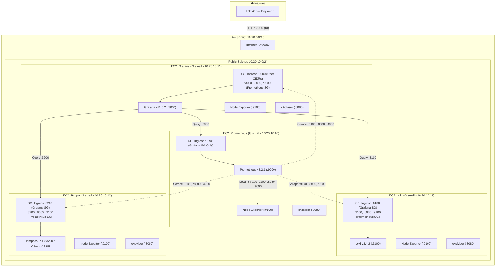

# Architecture & Topology

Each core observability component runs isolated on its own EC2 instance within a dedicated AWS VPC. Every node runs **Node Exporter** and **cAdvisor** alongside the core service, providing 360-degree observability across host OS, container runtime, and application engine layers.

---

## 🏛️ Topology Diagram



---

## 🎨 Interactive Architecture Visualizer

Below is the standalone HTML render of the full architecture map:

<iframe src="../architecture.html" class="architecture-frame" title="Architecture Diagram"></iframe>

/// note | Diagram Files
- **Standalone Full-Screen HTML**: [Open `architecture.html`](architecture.html){ target="_blank" }
- **Static High-Res PNG**: [Download `architecture.png`](architecture.png){ target="_blank" }
- **Editable Source**: [Download `architecture.drawio`](architecture.drawio){ target="_blank" }
///

---

## 🌐 Private Networking & Deterministic Addressing

The infrastructure uses deterministic static IP calculation via Terraform's `cidrhost()` function within the subnet `10.20.10.0/24`:

| Node Name | Instance Type | Private IP | Hostname / Role |
| :--- | :--- | :--- | :--- |
| **Prometheus** | `t3.small` | `10.20.10.10` | Time-series metrics engine & scraper |
| **Loki** | `t3.small` | `10.20.10.11` | Log aggregation & TSDB v13 indexer |
| **Tempo** | `t3.small` | `10.20.10.12` | Distributed tracing & OTLP receiver |
| **Grafana** | `t3.small` | `10.20.10.13` | Web UI & unified visualization console |

---

## 💾 Host Storage Architecture (`/opt/observability/data`)

Instead of Docker-managed named volumes, each instance mounts host directories directly with explicit UID/GID ownership:

```text
/opt/observability/
└── data/                   <--- Bind mounted to container engine storage
```

| Service | Container Mount Point | Host Directory | Required Ownership (UID:GID) |
| :--- | :--- | :--- | :--- |
| **Grafana** | `/var/lib/grafana` | `/opt/observability/data` | `472:472` (`grafana`) |
| **Prometheus** | `/prometheus` | `/opt/observability/data` | `65534:65534` (`nobody`) |
| **Loki** | `/loki` | `/opt/observability/data` | `10001:10001` (`loki`) |
| **Tempo** | `/var/tempo` | `/opt/observability/data` | `10001:10001` (`tempo`) |
